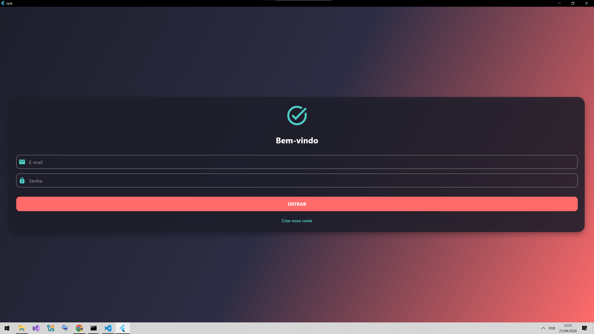
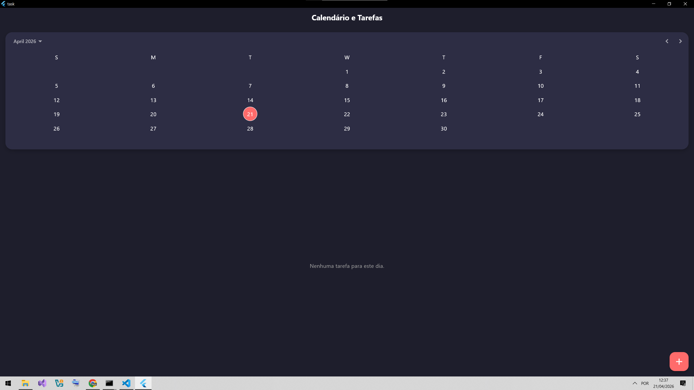
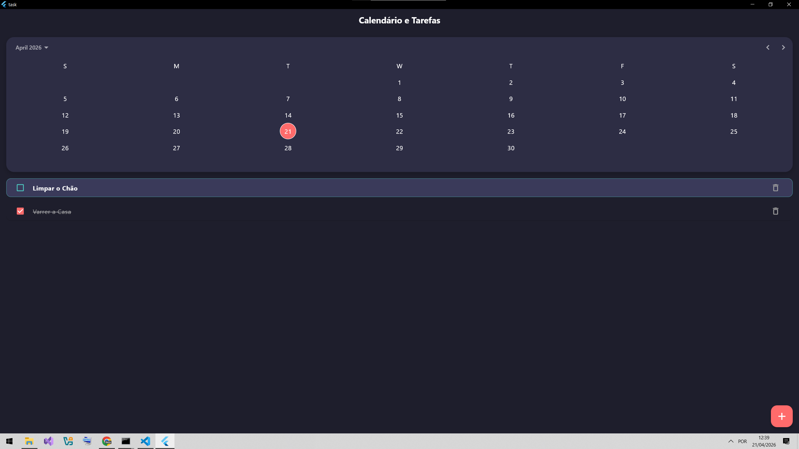

# Task - Gerenciador de Tarefas com Flutter

Este projeto consiste em um aplicativo de gerenciamento de tarefas desenvolvido para a disciplina de Desenvolvimento de Dispositivos Móveis. A aplicação permite o cadastro de usuários, autenticação local e a gestão de atividades organizadas por data, utilizando persistência de dados em banco de dados relacional.

## Link do Repositório

[https://github.com/Guilherme3826/task](https://github.com/Guilherme3826/task)

---

## Demonstração do Aplicativo

<table style="width: 100%; text-align: center;">
  <tr>
    <td><strong>Tela de Login</strong></td>
    <td><strong>Calendário</strong></td>
    <td><strong>Lista de Tarefas</strong></td>
  </tr>
  <tr>
    <td></td>
    <td></td>
    <td></td>
  </tr>
</table>

---

## Descrição do Projeto e Conclusão

O presente projeto foi desenvolvido utilizando a linguagem **Dart** e o framework **Flutter**, adotando uma arquitetura baseada na separação entre a camada visual (`StatefulWidget` e `StatelessWidget`) e a camada de dados, abstraída através da classe `TaskRepository`. O design da interface foi elaborado para fugir de layouts genéricos, empregando uma paleta de cores vibrantes, gradientes lineares e sombras para proporcionar uma experiência de usuário (UX) moderna e atrativa.

### Persistência de Dados e Compatibilidade

Para a persistência local de dados, implementei o banco de dados relacional **SQLite** utilizando o pacote `sqflite`. Devido à execução e simulação do aplicativo em ambiente **Windows Desktop**, foi necessário integrar o pacote auxiliar `sqflite_common_ffi` e configurar o `databaseFactory` no ponto de entrada da aplicação (`main.dart`), garantindo assim a total compatibilidade da engine do SQLite fora do ecossistema mobile tradicional.

O banco de dados foi modelado com duas tabelas:

- **users**: Para gerenciar as credenciais com restrição de e-mail único.
- **tasks**: Para armazenar as atividades atreladas às datas.

A classe modelo `Task` foi equipada com os métodos de serialização `toMap` e `fromMap`, responsáveis por traduzir os objetos da memória para o banco e vice-versa.

### Lógica de Negócio e UX

Na camada de lógica de negócios, o fluxo de Cadastro e Login realiza validações de entrada e consultas assíncronas (`async`/`await`) no SQLite. O feedback das ações de autenticação (sucesso, senhas divergentes ou e-mail duplicado) é exibido ao usuário através de componentes `SnackBar` gerenciados pelo `ScaffoldMessenger`.

A tela principal integra o componente `CalendarDatePicker` com uma `ListView.builder`. O gerenciamento de estado é feito de forma nativa utilizando `setState()`, que recarrega a lista após qualquer operação de I/O no banco de dados (inserir via `ShowDialog`, deletar ou alternar o status de conclusão).

### Algoritmo de Ordenação

Para cumprir rigorosamente o critério de ordenação exigido, implementei um algoritmo customizado utilizando o método `sort()` do Dart sobre a lista filtrada pela data ativa. A função de ordenação prioriza a propriedade booleana `isCompleted` para garantir que tarefas pendentes sejam indexadas no topo. Quando duas tarefas compartilham o mesmo status de conclusão, o algoritmo aplica um `compareTo` nos títulos convertidos para letras minúsculas, assegurando a ordenação alfabética secundária.

---

## Tecnologias Utilizadas

- **Flutter & Dart**: Framework e linguagem base.
- **SQLite (sqflite)**: Persistência de dados local.
- **sqflite_common_ffi**: Suporte ao SQLite para ambiente Windows Desktop.
- **intl**: Manipulação e formatação de datas.

---

## Estrutura de Arquivos (Pasta lib)

- `main.dart`: Ponto de entrada e configuração do banco.
- `task_model.dart`: Classes de modelo e repositório SQLite.
- `login_screen.dart`: Interface e lógica de autenticação.
- `register_screen.dart`: Interface para criação de novas contas.
- `calendar_task_screen.dart`: Tela principal e lógica de ordenação.

---

## Como Executar o Projeto

1. Certifique-se de ter o Flutter instalado e configurado.
2. Clone este repositório:
   ```bash
   git clone [https://github.com/Guilherme3826/task.git](https://github.com/Guilherme3826/task.git)
   ```
